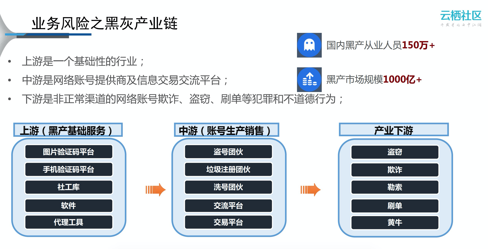
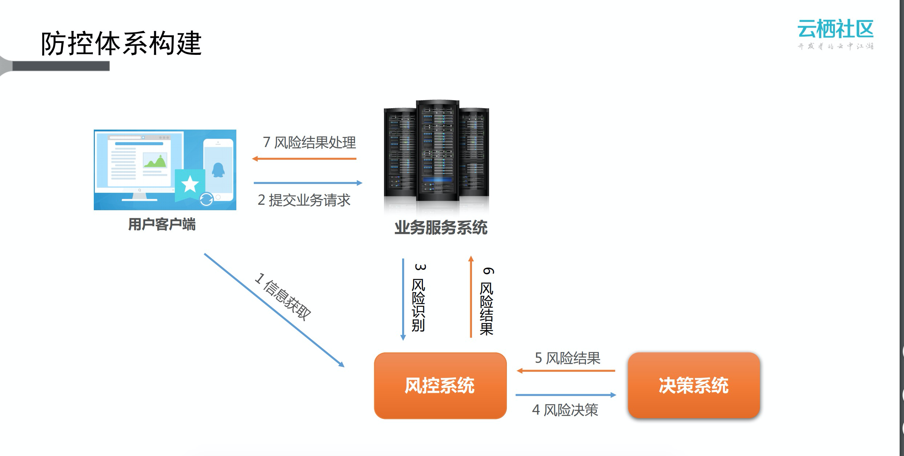
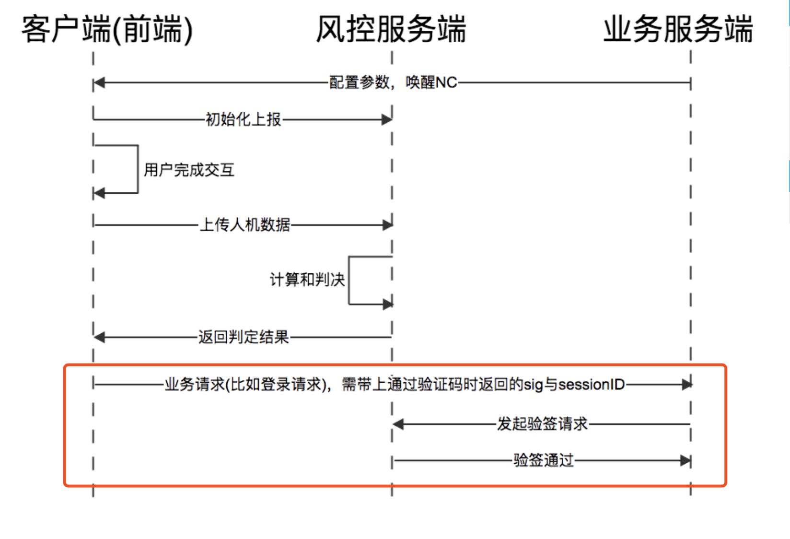
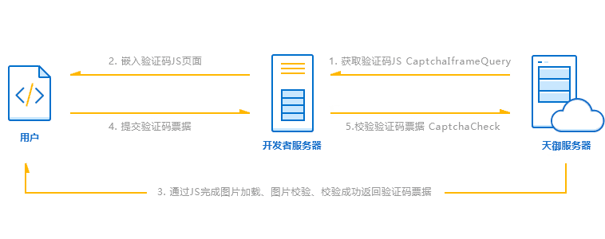

### 1. 常见的互联网业务风险
1）注册环节：垃圾注册
2）登录环节：账号泄漏、洗库撞库
3）业务环节：撸羊毛、刷票、作弊、业务漏洞、盗卡盗刷、垃圾信息

### 2. 业务防控体系
一般的解决方案是在注册、登录、业务等环节上进行防控布点，风控系统以js代码、SDK、webapi的方式集成到业务流程中，
并通过事前的信息数据采集和监控、事中的风险识别验证和控制以及预警、事后的溯源追踪来保证业务的安全性，其中风险验证常用的有滑动、图片码验证等手段。
而风险的识别由决策系统根据账号、行为、环境等因素，结合大数据的模型引擎，来决策风险等级。

####阿里云盾接入流程：

####腾讯云天御接入流程：

1）客户端从服务端获取验证码 JS 文件
2）客户端嵌入验证码JS页面（iframe形式）
3）用户完成验证码验证
4）客户端获得验证 ticket，并提交服务端进行二次验证
5）服务端通过天御服务器接口进行ticket验证

链接：
[风控PM必知必会：互联网业务安全的黑灰产业链的故事](http://www.woshipm.com/it/448761.html)
[互联网风控系统](https://www.jianshu.com/p/5d56afbe961f)
[阿里云数据风控产品的介绍及应用](https://yq.aliyun.com/articles/521850?utm_content=m_43560)

